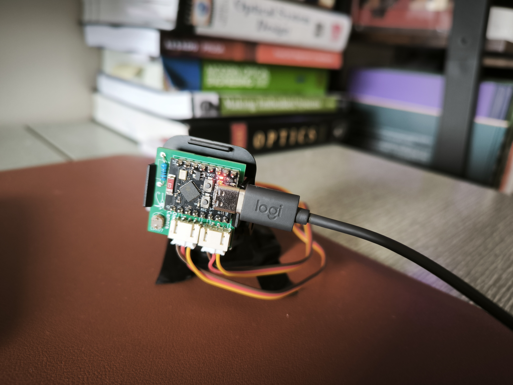

# One_Pixel_Camera

## Concept
This project implements a scanning "One-Pixel Camera" using a single visible (peaking at 540nm) photodiode and a 2-axis servo gimbal. Instead of using a traditional multi-megapixel sensor, this camera reconstructs an image by mechanically sampling light intensity across a grid.


### The pixel
The core of the camera is a single photodiode housed inside a narrow tube. This tube acts as a mechanical aperture, restricting the field of view so the sensor only detects light from a specific, pinpoint location.


### Signal Processing
The photodiode is connected to an Analog-to-Digital Converter (ADC) pin on the microcontroller. By reading the voltage level, the system can determine the relative brightness of the specific point at which the sensor is aimed.


### The Scanning Mechanism (Gimbal)
To generate a 2D image, the system utilizes two Servo Motors to create a pan-tilt gimbal. This allows the "pixel" to move across two axes, X-axis and Y-axis.


### Image Reconstruction
The microcontroller (micropython) executes a Raster Scan (or "snake" pattern). It aims the sensor at a specific (x,y) coordinate, records the light intensity, and moves to the next point. Using a closed loop motor is recommended (SG90 with potentiometer/feedback device). Once the grid is complete, the collected data points are compiled into an array and visualized as a grayscale or thermal-style map via a python script.


## Prototype
<table align="center">
  <tr>
    <td align="center" colspan="2">
      <br/>
      <b>Full integrated device without the tube.</b>
    </td>
  </tr>
</table>


## Components
To control the position, a feedback of the motor position is required.


## Pinout
Analog pins are required:

```
ESP32   -   GL5516 (PD)     -    S90 (X)  -     S90 (Y)
G0            Short
G1                                PWM
G2                                                PWM
5V            Long                5V              5V
GND          6.8 kOhm             GND             GND
```

as:

```
(5V) --- [6.8kΩ resistor] --- + --- [GPIO ADC INPUT]
                              |
                          GL5516 (PD)
                              |
                            (GND)
```


## Inspiration
https://chynehome.com/web/index.php/2015/01/29/appareil-photo-de-1-pixel-avec-un-arduino/
